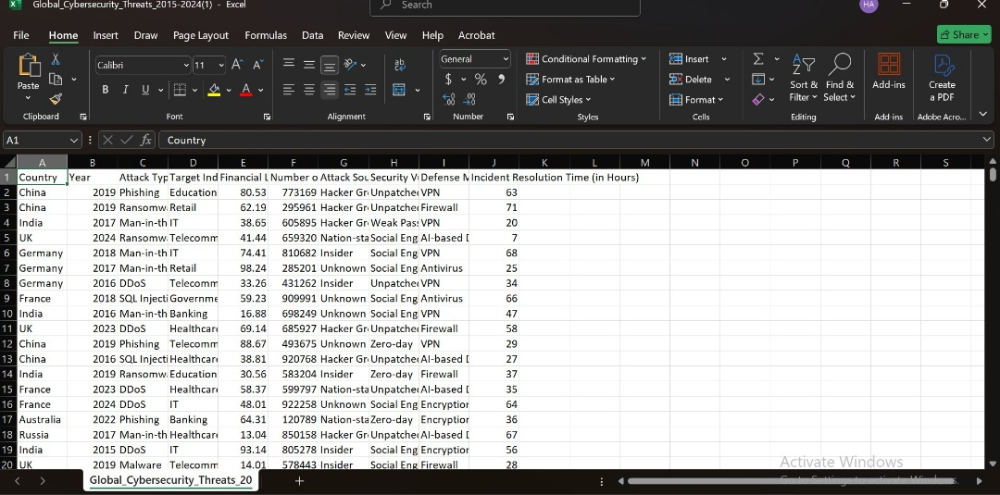
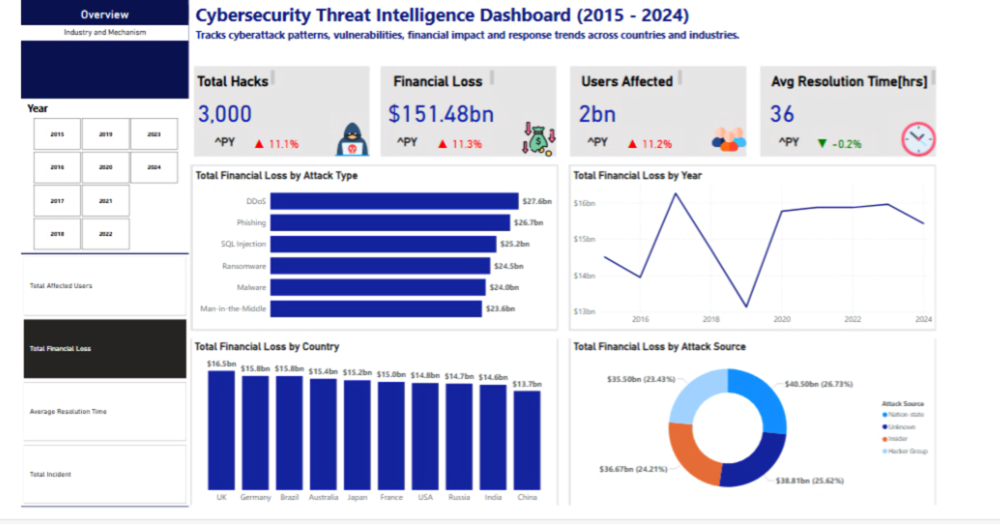
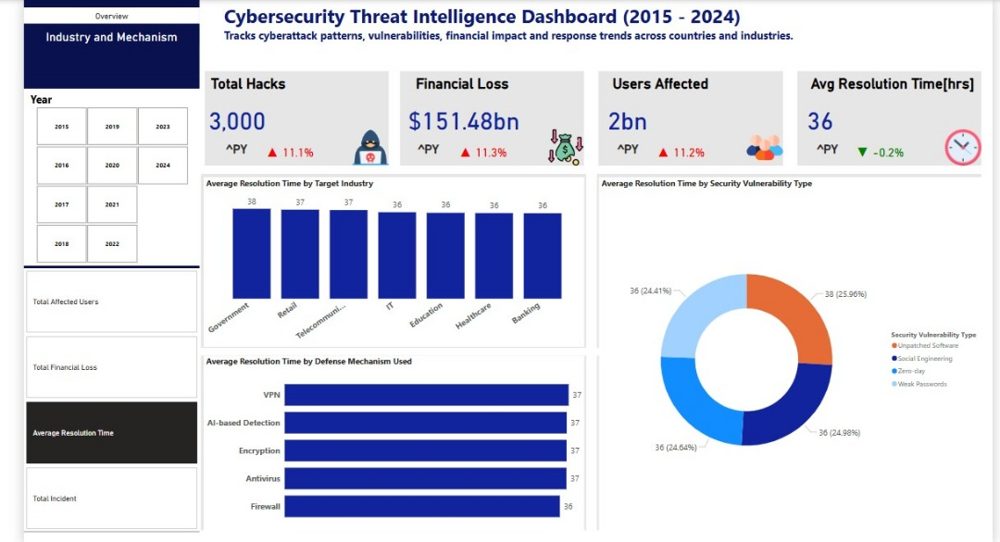

# IOTBTECH-DATA-ANALYTICS-TRACK-Village-Sync-Report
# Cybersecurity-Threat-Intelligence Analysis

# Introduction : Project Overview

## Title:Global Cybersecurity Threats Analysis (2015–2024)
This is a power BI project on threat analysis.
This report analyzes 3,000 cybersecurity incidents recorded between 2015-2024 across 10 countries, sourced from Kaggle's cybersecurity dataset. Key findings reveal $151 billion in financial losses, 2 billion users affected, and an average 36-hour resolution time for security incidents. The UK, Germany, and Brazil emerged as the most impacted nations, while DDoS, phishing, and zero-day exploits were the most damaging attack vectors.

Dataset: Contains cyberattack records across countries, industries, and attack types, including fields like:
-  Year, Country, Industry, Attack Type,
-  Financial Loss ($M), Users Affected, Resolution Time, Vulnerability Type

# Project Goal
The goal of this analysis is to assess the global impact of cybersecurity threats between 2015 and 2024 by examining attack trends, financial losses, affected industries, and geographical hotspots. Using Kaggle’s cybersecurity dataset, this project aims to:

-  Quantify the economic and operational damage caused by cyberattacks
-  Identify the most prevalent attack methods and exploited vulnerabilities
-  Highlight high-risk industries and regions
-  Provide actionable insights to improve organizational cybersecurity strategies

#  Methodology
This project followed a structured data-driven approach to analyze global cybersecurity threats from 2015–2024. The methodology consisted of four key phases:

1. Data Collection & Sourcing
2. Data Cleaning & Preprocessing
3. Data Analysis
4. Reporting & Visualization

# Data Visualization

Below are screenshots of data in MS Excel and Power BI during data modelling and analysis

To interact with this visual, [CLICK HERE](https://app.powerbi.com/view?r=eyJrIjoiNDRkYjRmYjEtZjZkMi00MTA0LTk5YmYtYzNmZjYwMThlNDgyIiwidCI6IjcwYTQ5OGM0LTY5YjQtNDdlOS04NjExLTE3MmJmMzg3MzU5MyJ9)

Data in Excel                        | Data in Power BI                     | Data Modelling
:-----------------------------------:| :-----------------------------------:| :-----------------------------------:
                       |                     |    

Dashboards:
Overview                             | Industry and Defense Mechanism             
:-----------------------------------:| :-----------------------------------:
                  |                   

#  Key Statistics
-  Total Attacks: 3000
-  Users Affected: 2 Billion
-  Total Financial Loss:   $151 Billion
-  Average Resolution Time: 36 Hours
  
##  Trends & Insights
1. Financial Impact by Country
-  The Kaggle dataset shows the United Kingdom suffered the highest financial damage ($16.5 billion), followed by Germany ($15.8 billion).
-  While Brazil recorded the highest attack volume, China showed the lowest incident rates in the dataset.

2. Industry-Specific Impacts
-  IT sector losses totaled $25 billion
-  Banking/finance losses reached $23 billion
These sectors remain prime targets due to their data sensitivity.

3. Critical Vulnerabilities
-  Zero-day exploits impacted 26% of victims ($39 billion loss)
-  Weak passwords contributed significantly to breaches
  
4. Most Prevalent Attack Methods
-  DDoS attacks caused $27.6 billion in damages
-  Phishing schemes accounted for $26.7 billion in losses
-  SQL injection attacks remained a persistent threat

5. Peak Attack Years
The data reveals 2017 as the most damaging year ($16 billion lost), with 2023 being the second-worst year ($15 billion), indicating evolving threat patterns.

6. Threat Actor Analysis
-  26.73% of attacks to nation-state actors
-  25.62% to unknown hacker groups
This highlights significant attribution challenges in cybersecurity investigations.

#  Recommendations for Mitigation
-  Enforce Stronger Authentication: Mandate multi-factor authentication (MFA) and password policies to reduce phishing and brute-force attacks.
-  Invest in Zero-Day Defense: Deploy advanced threat detection and patch management systems to counter unknown exploits.
-  Enhance DDoS Protection: Implement scalable traffic filtering and cloud-based mitigation to minimize service disruptions.
-  Prioritize High-Risk Industries: The IT and banking sectors require real-time monitoring and incident response teams to curb escalating threats.
-  Improve Cyber Threat Intelligence: Strengthen collaboration between governments and enterprises to track nation-state actors and emerging hacker groups.

#  Conclusion
-  Cyber threats have grown in scale, sophistication, and financial impact over the past decade. 
-  With $151 billion lost and 2 billion users compromised, organizations must adopt proactive security measures to mitigate risks. 
-  The UK, Germany, and Brazil remain high-value targets, while DDoS, phishing, and zero-day exploits continue to dominate attack vectors. 
-  A combination of technological investment, workforce training, and international cooperation will be essential in building resilience against future attacks.

Prepared by:                                                   
IOTB TECH FELLOWSHIP,  DATA ANALYTICS CLASS OF 25     

Date: 27 JUNE 2025                                
Data Source: Kaggle Dataset
